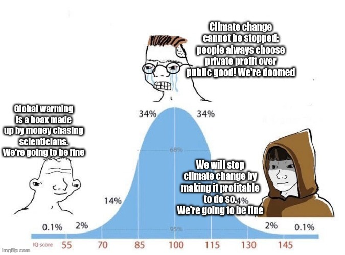

# 🏔 DRM DAO

**A DRM DAO is a coordinated flow of strategic capital to advance the heroic efforts to regenerate the planet.**

The first DRM DAO is the DRM Syndicate. The DRM Syndicate is community first. Everybody gets in at the same ground floor. No preferred mints, no insider rounds.&#x20;

A simple 1 USDC = 1 ✺DRM.

[Click here to get $DRM and join the DRM Syndicate.](https://app.syndicate.io/clubs/0x99d61e194b0b677fa0a8215ad00d852cddd4cd9f)

## **DRM Syndicate**

_DRM tokens can be bought with USDC and are non-transferrable governance tokens fractionalizing the holdings of the DRM Syndicate Gnosis Safe._

We've partnered with carbon marketplace [Patch.io](https://patch.io) to curate a set of tier-1 quality projects in the industry. These projects have the scarcest and most valuable carbon removals in the industry.

_$8M would buy out Patch's entire inventory and make the DRM Syndicate a tier-1 global carbon remover._

Furthermore, we will only be purchasing from projects independently assessed by [(carbon)plan](https://carbonplan.org/research/cdr-database), the leader in improving the transparency and scientific integrity of carbon removal and climate solutions through open data and tools.

### Success means...

1. Raising $8M to become a tier-1 global carbon remover.
2. Commissioning a Badge of Honor NFT exclusively for DRM Syndicate members
3. Celebrating with an in-person event

****

**LFG: Let's fucking grow.** [Click here to get $DRM and join the DRM Syndicate.](https://app.syndicate.io/clubs/0x99d61e194b0b677fa0a8215ad00d852cddd4cd9f)

****

When the time comes, [Toucan Protocol](https://toucan.earth) will help us tokenize the carbon into CDRM (Carbon Dioxide Removal Mass) tokens on Polygon.

### What's next?

[eden-dao-protocol.md](eden-dao-protocol.md "mention") will offer the EDEN CDRM BOND. DRM Syndicate may bond CDRM to mint gEDN, the non-transferrable network governance token.
